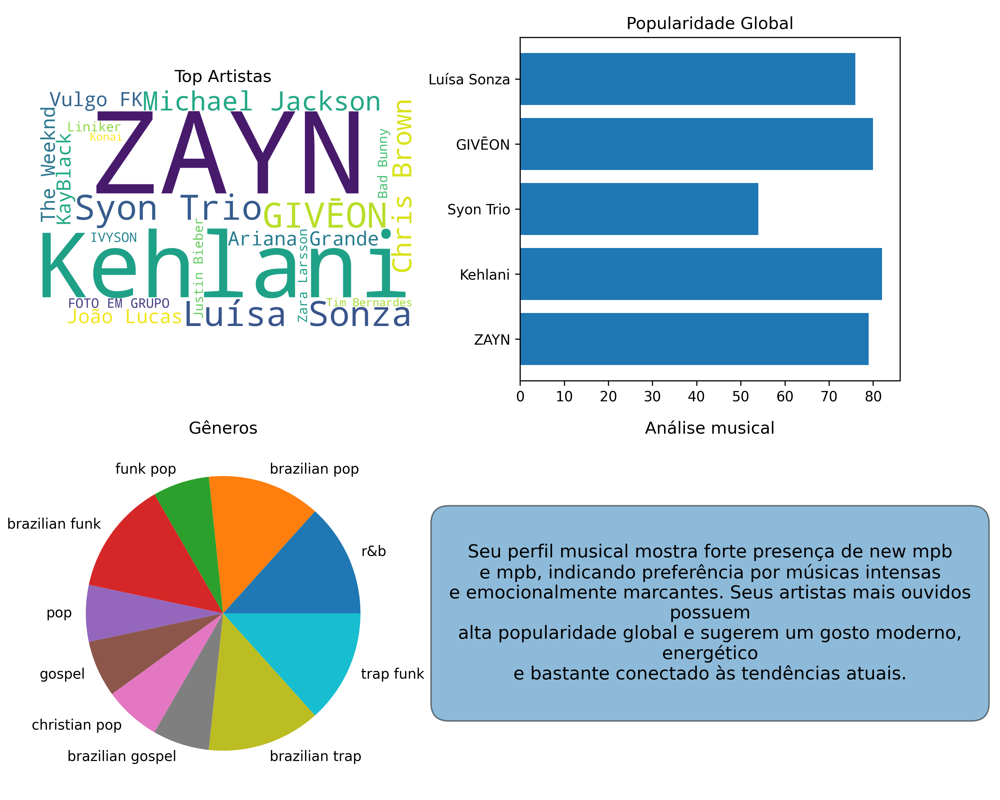

# 🎧 Spotify Artist Word Cloud

Projeto em Python que gera uma **nuvem de palavras** e gráficos com os artistas e gêneros mais ouvidos no Spotify, usando a API oficial.

## 🚀 Tecnologias
- Python
- Spotipy
- WordCloud
- Matplotlib

## 🎯 Gráficos
☁️ WordCloud (artistas mais ouvidos)
📊 Popularidade dos top artistas
🎵 Gêneros mais escutados
📈 Distribuição / ranking

## 🎨 Resultado

Uma nuvem de artistas mais ouvidos 🎶☁️

  

## 🔑 Configuração
Crie um arquivo `.env` na raiz do projeto com:

SPOTIPY_CLIENT_ID=seu_client_id
SPOTIPY_CLIENT_SECRET=seu_client_secret